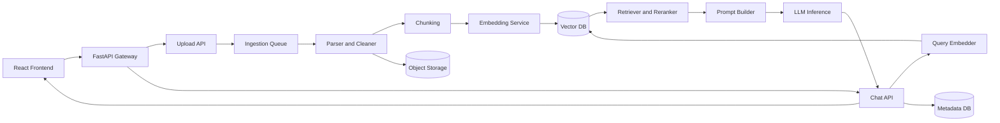

# KnowledgeForge AI

KnowledgeForge AI is a production-oriented Personal Knowledge AI platform that lets users upload private documents and ask natural-language questions over their own knowledge base.

It is designed as an end-to-end Retrieval-Augmented Generation (RAG) system with a FastAPI backend, React frontend, semantic retrieval pipeline, and CI/CD automation.

## Table of Contents

- [Project Overview](#project-overview)
- [Core Features](#core-features)
- [How It Works (End-to-End)](#how-it-works-end-to-end)
- [System Architecture](#system-architecture)
- [Tech Stack](#tech-stack)
- [Repository Structure](#repository-structure)
- [API Surface](#api-surface)
- [Development Phases and Roadmap](#development-phases-and-roadmap)
- [Local Setup and Run](#local-setup-and-run)
- [CI/CD Pipeline](#cicd-pipeline)
- [Production Considerations](#production-considerations)
- [Observability and Quality](#observability-and-quality)
- [Security and Privacy](#security-and-privacy)
- [Contribution Guide](#contribution-guide)
- [License](#license)

## Project Overview

KnowledgeForge AI turns unstructured personal documents into a searchable semantic memory layer.

Users can:
- Upload PDFs, TXT files, and DOCX documents.
- Trigger ingestion and indexing.
- Ask questions in natural language.
- Receive grounded responses with source chunks.

This repository currently includes a startup-ready full-stack baseline:
- FastAPI backend scaffold with document upload and chat query endpoints.
- React + Vite frontend scaffold with upload and Q&A UI.
- GitHub Actions CI/CD workflow for backend and frontend validation.

## Core Features

- Document upload API for ingestion queue handoff.
- Chat query API for RAG orchestration.
- Source-aware response contract for answer grounding.
- Environment-driven backend configuration with CORS support.
- Frontend API integration with typed contracts.
- CI pipeline for build, type-check, and backend import validation.

## How It Works (End-to-End)

1. User uploads a document from the frontend.
2. Backend receives file metadata and queues it for ingestion.
3. Ingestion pipeline extracts text, cleans content, and chunks documents.
4. Embedding service converts chunks into vector representations.
5. Vectors are indexed in a vector database.
6. User submits a natural-language question.
7. Question is embedded and matched against indexed chunks.
8. Top relevant chunks are injected into an LLM prompt.
9. Model generates a grounded answer with source evidence.
10. Frontend displays answer and retrieved sources.

## System Architecture



## Tech Stack

Backend:
- FastAPI
- Pydantic Settings
- Uvicorn

Frontend:
- React
- TypeScript
- Vite
- TanStack Query

Infrastructure and Delivery:
- GitHub Actions for CI/CD
- Environment-based configuration
- Deployable backend/frontend artifacts

## Repository Structure

```text
.
├── .github/
│   └── workflows/
│       └── ci.yml
├── backend/
│   ├── app/
│   │   ├── core/
│   │   │   └── config.py
│   │   ├── routers/
│   │   │   ├── chat.py
│   │   │   ├── documents.py
│   │   │   └── health.py
│   │   ├── services/
│   │   │   └── rag_service.py
│   │   └── main.py
│   ├── .env.example
│   └── requirements.txt
└── frontend/
    ├── src/
    │   ├── App.tsx
    │   ├── main.tsx
    │   └── lib/api.ts
    ├── .env.example
    ├── package.json
    └── vite.config.ts
```

## API Surface

Base prefix: `/api/v1`

- `GET /health/`
  - Health check endpoint.

- `POST /documents/upload`
  - Form-data upload endpoint.
  - Inputs: `user_id`, `file`.
  - Current behavior: confirms receive-and-queue placeholder.

- `POST /chat/query`
  - JSON question endpoint.
  - Input: `{ "user_id": "...", "question": "..." }`
  - Output: `{ "answer": "...", "sources": [...] }`

## Development Phases and Roadmap

### Phase 1: Foundation (Completed)

- Backend and frontend startup configuration.
- Core API scaffolding (health, upload, query).
- Typed frontend-backend integration.
- Initial CI/CD workflow.

### Phase 2: Ingestion Pipeline (In Progress)

- PDF/TXT/DOCX extraction modules.
- Text cleaning and normalization.
- Chunking strategy (semantic + overlap).
- Metadata schema and persistence.

### Phase 3: Semantic Retrieval

- Embedding model integration.
- Vector database integration (FAISS/Chroma/Pinecone/Weaviate).
- Query-time retrieval and reranking.

### Phase 4: Grounded Answer Generation

- Prompt templates with context injection.
- Hallucination controls and abstain behavior.
- Source citation quality improvements.

### Phase 5: Production Readiness

- Background workers and queue reliability.
- Caching, rate limiting, and retry policies.
- Monitoring, tracing, and cost dashboards.
- Security hardening and multi-tenant isolation.

### Phase 6: Scale and Optimization

- High-throughput ingestion and indexing.
- Model and retrieval performance tuning.
- Autoscaling and deployment topology optimization.

## Local Setup and Run

Prerequisites:
- Python 3.12+
- Node.js 22+
- npm 10+

### Backend

```bash
cd backend
python -m venv venv
# Windows
venv\Scripts\activate
# macOS/Linux
# source venv/bin/activate

pip install -r requirements.txt
uvicorn app.main:app --host 0.0.0.0 --port 8000 --reload
```

### Frontend

```bash
cd frontend
npm ci
npm run dev
```

App URLs:
- Frontend: `http://localhost:5173`
- Backend: `http://localhost:8000`
- API docs: `http://localhost:8000/docs`

## CI/CD Pipeline

Workflow file: `.github/workflows/ci.yml`

Current pipeline includes:
- Backend CI:
  - Dependency installation.
  - Python compile validation.
  - FastAPI app import check.
- Frontend CI:
  - Dependency installation.
  - Type checking.
  - Production build.
- Main branch packaging stage:
  - Uploads frontend `dist` artifact.
  - Uploads backend deploy bundle artifact.

## Production Considerations

- Replace placeholder ingestion with async worker queue.
- Add persistent metadata store and object storage.
- Integrate chosen vector database and embedding provider.
- Add model gateway with fallback providers.
- Include strict prompt policies for grounded answers.

## Observability and Quality

Recommended metrics:
- Retrieval quality: Recall@k, MRR.
- Groundedness: answer-to-source support score.
- Performance: p50/p95 latency, throughput.
- Reliability: ingestion success rate, queue retries.
- Product metrics: user satisfaction and task completion.

## Security and Privacy

- Keep private document data encrypted in transit and at rest.
- Use strict tenant-aware filtering in retrieval.
- Avoid exposing raw secrets in repository.
- Rotate compromised or leaked keys immediately.
- Implement audit logs for document and query access.

## Contribution Guide

1. Create a feature branch from `main`.
2. Make focused changes with clear commit messages.
3. Ensure local backend/frontend checks pass.
4. Open a PR and wait for CI validation.

## License

License is currently not defined.

Add a `LICENSE` file before public production usage.
